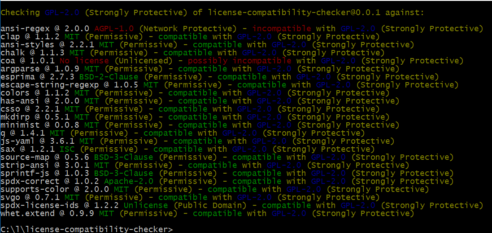
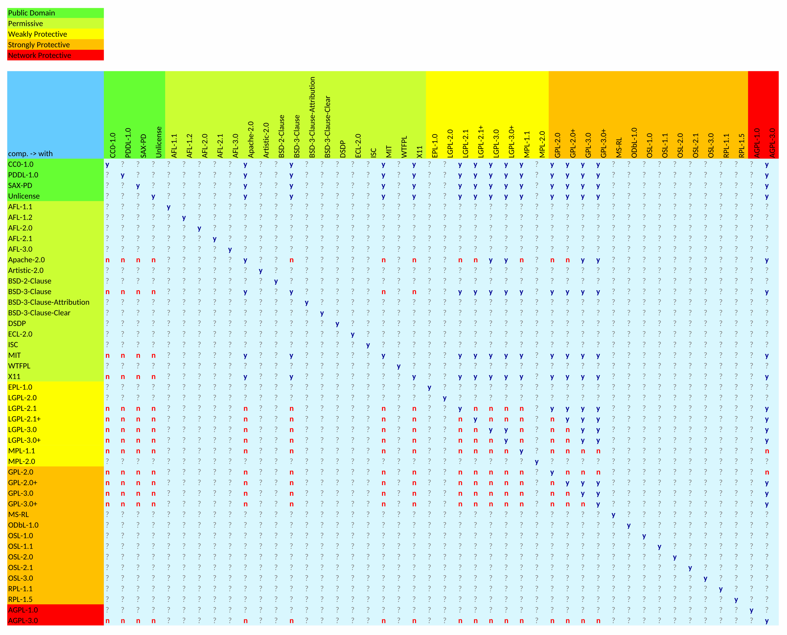

# license-compatibility-checker

Check npm dependencies' package.json for license compatibility (aka compliance check) with the current project based on
spdx notation and naming conventions.

### This is a fork of [license-compatibility-checker](https://github.com/HansHammel/license-compatibility-checker)

The original repository seems to no longer be maintained.

I am making several changes to the code and adding new features. It should work as it did before, but I am not sure
if everything is working as expected.

## This is WIP and likely to change but already usable.

Does a simple comparison like Public Domain > Permissive > Weakly Protective > Strongly Protective > Network Protective
of the primary dependencies in node_modules (no recursive search).
Checks for unlicensed or unknown licenses.

Screenshot with sample data (some licenses changed for demo)
[](assets/screen.png)

# Install

```sh
npm install license-compatibility-checker -g
```

or better

```sh
npm install license-compatibility-checker --save-dev
```

or

```sh
npm install https://github.com/undercroftjs/license-compatibility-checker.git --save-dev
```

# Usage

## CLI

In your project folder run

```bash
license-compatibility-checker
```

or

```bash
lcc PATH_TO_PACKAGE_JSON
```

or (win)

```bash
.\node_modules\.bin\lcc ..\droppy\package.json c:/l/droppy/node_modules
```

or (*nix)

```bash
./node_modules/.bin/lcc PATH_TO_PACKAGE_JSON PATH_TO_MODULES
```

etc.

Supports to optional parameters:

1. path to package json (defaults to ./package.json)
2. path to node_modules (defaults to ./node_modules)

Paths can be relative to the CWD and/or mixed Win/nix-style

## As Module

### v0.2.x

```node
var lcc = require('license-compatibility-checker');
var path = require('path');
lcc.check(path.join(process.cwd(), 'package.json'), path.join(process.cwd(), "node_modules"), function(/*error*/ err,/*boolean*/ passed,/*string*/ output) {
  if (err) console.log(err);
  else if (passed) {
    //No license issues found
    console.log(output);
  } else {
    //License issues found 
    console.log(output);
    //process.exit(1);
    //or
    //throw new Error('License issues found');
  }
});
```

### v0.1.1

```node
var lcc = require('license-compatibility-checker');
var path = require('path');
lcc.check(path.join(process.cwd(), 'package.json'), path.join(process.cwd(), "node_modules"));
```

## Legal notice

use without warranty

### Honorable Mention

Based on license-compatibility ruby gem by Libraries.io

## A License Overview

[](assets/licenses.svg)
